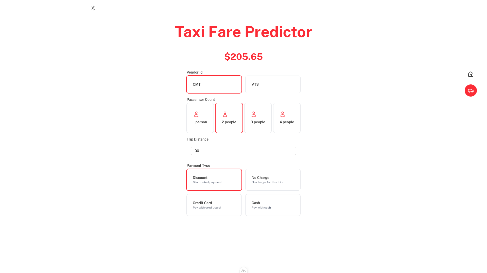

# Xita

This application predicts taxi fares in New York City based on user inputs such as pickup and drop-off locations, date and time, and
passenger count.

Using the predict api sample from ML.NET, check the [ML.NET Taxi Fare Prediction Sample](https://github.com/dossancto/taxi-fare-prediction-mlnet) repository.



## Setup

Make sure to install the dependencies:

```bash
pnpm install
```

## Development Server

Start the development server on `http://localhost:3000`:

```bash
pnpm dev
```

